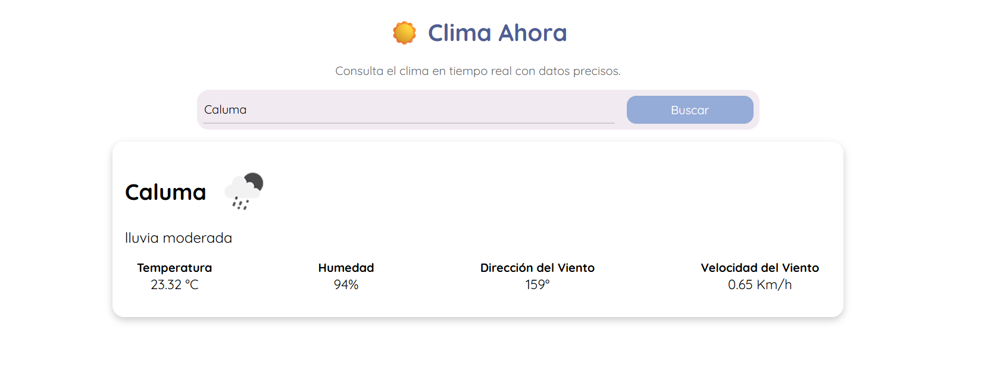

Este proyecto es un clon de una aplicación del clima. Se obtienen datos reales a través de la API de OpenWeather. Cuenta con una interfaz simple en la que encontrarás un buscador; al ingresar una ciudad, aparecerá una tarjeta con la información climática correspondiente: temperatura, icono, descripción, humedad, velocidad del viento y dirección del viento.

## Objetivo

Comprender el funcionamiento de una API con clave, y practicar la manipulación del DOM de manera eficiente.

## Tecnologías Utilizadas

- HTML
- CSS
- JavaScript
- Git
- GitHub
- OpenWeather (API para obtener información del clima)

## Componentes Principales

- **Buscador**: Permite buscar la ciudad de la cual se desea obtener el clima. Se activa mediante el botón de búsqueda.
- **Tarjeta del Clima**: Muestra una tarjeta con toda la información de la ciudad buscada, incluyendo: nombre, icono, descripción, temperatura, velocidad del viento y dirección del viento.

## Captura de Pantalla
